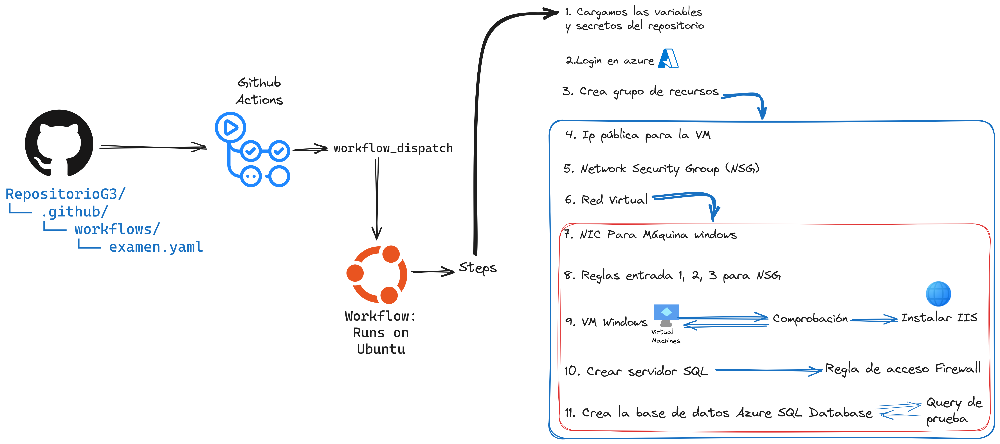

<h1 align="center"">Administracion de aplicaciones corporativas ☁️</h1> 
<h2 align="center"">AAY5121-002V-2024-1-repo-G3</h2>

## Scripts hechos:
- Bash ✅

# Material
- [Azure Github Credentials](https://learn.microsoft.com/es-es/azure/developer/github/connect-from-azure?tabs=azure-portal%2Clinux#use-the-azure-login-action-with-a-service-principal-secret)
- [Azure CLI Bash VM & SII](https://learn.microsoft.com/en-us/azure/virtual-machines/windows/quick-create-cli)
- [Azure CLI Powershell VM & SII](https://learn.microsoft.com/en-us/azure/virtual-machines/windows/quick-create-powershell)
- [Az group command](https://learn.microsoft.com/en-us/cli/azure/group?view=azure-cli-latest)
- [Az CLI SQL samples](https://learn.microsoft.com/en-us/azure/azure-sql/database/az-cli-script-samples-content-guide?view=azuresql&source=recommendations&tabs=single-database)
- [SQL DB with Firewall rules](https://learn.microsoft.com/es-es/azure/azure-sql/database/single-database-create-quickstart?view=azuresql&tabs=azure-cli)
- [Repos con documentacion de Azure](https://github.com/yorek/awesome-azure-sql?tab=readme-ov-file)

# Evaluacion1
[Cálculo TCO Evaluacion 1](https://azure.com/tco/eda9931abd9b40c99e15e82399488e7e/)

[Cálculo Calculadora](https://azure.com/e/27f760269bc14325829968bc10858258)

[Informe](https://docs.google.com/document/d/1WpwRQ1O5uwJFLZ6ILPEPDe3yON3-1esZ/edit?usp=sharing&ouid=107365392565102071783&rtpof=true&sd=true)

# Examen
## Github action workflow

[Intranet EV2 Muestra](https://duoccl0.sharepoint.com/sites/AAY5121-G3/SitePages/ITHelpdeskHome.aspx)

